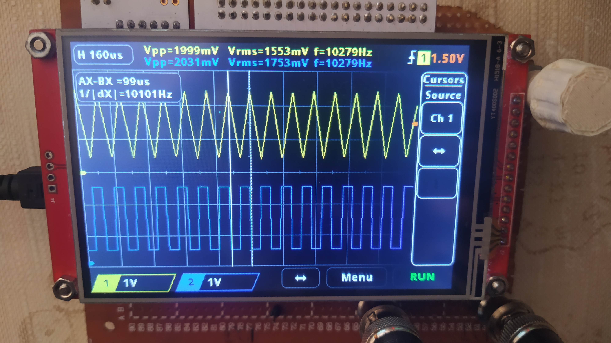
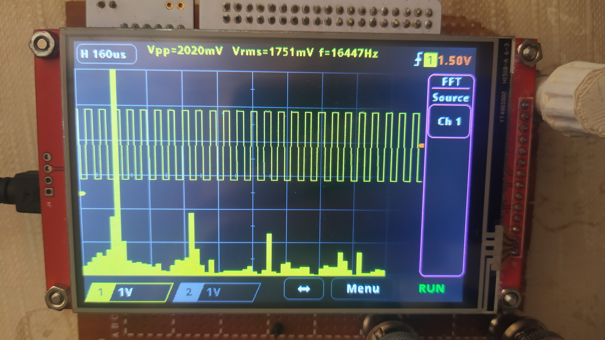

# KD 23MTS

 


This project is a simple oscilloscope built using an STML476RG microcontroller and a 4" TFT SPI 480x320px V2.1 LCD with an integrated ILI9488 driver and touchscreen with an XPT2046 driver. It was developed for the Robot Controllers project during the 6th semester of AiR at PWR.





## Project Goals
  - 2 channels
  - FFT (Fast Fourier Transform)
  - RMS, peak-to-peak, and frequency measurements
  - Horizontal and vertical cursors
  - Normal mode trigger (channel 1)

## Connections

- LCD
  | STM pin | Component pin | Signal description |
  |---------|---------------|--------------------|
  | PA6     | SDO(MISO)     | TFT_MISO           |
  | PC9     | LED           | TFT_Backlight      |
  | PB3     | SCK           | TFT_SCK            |
  | PA7     | SDI(MOSI)     | TFT_MOSI           |
  | PC4     | DC/RS         | TFT_DC/RS          |
  | PA10    | RESET         | TFT_RESET          |
  | PC8     | CS            | TFT_CS             |


- Touchscreen
  | STM pin | Component pin | Signal description |
  |---------|---------------|--------------------|
  | -----   | T_IRQ         | T_IRQ              |
  | PC2     | T_DO          | Touch_MISO         |
  | PC3     | T_DIN         | Touch_MOSI         |
  | PB12    | T_CS          | Touch_CS           |
  | PB10    | T_CLK         | Touch_SCK          |

- Rotary encoder
  | STM pin | Component pin |
  |---------|---------------|
  | PA9     | ENC_A         |
  | PA8     | ENC_B         |
  | PC0     | ENC_BTN       |

- Oscilloscope channels
  | STM pin | Component pin   | Signal description |
  |---------|-----------------|--------------------|
  | PC5     | BNC connector 1 | Channel 1          |
  | PB1     | BNC connector 2 | Channel 2          |


- Test signal output
  | STM pin | Component pin     | Signal description |
  |---------|-------------------|--------------------|
  | PB0     | GEN OUT connector | 1kHz test signal   |

## Touchscreen calibration
1. Navigate to the file `oscilloscope.c` and locate line 35. Remove the comment slashes (`//`) to activate the function `touchScreenCalibration();`. Save the changes and upload the code to the device.
2. Open a Serial monitor on your PC. You should observe the following prompt:
    ```
    Press the screen at the yellow squares that appear,
    then paste the following line into stm32_adafruit_ts.h :
    ```
3. Interact with the LCD screen by pressing on the three yellow squares. Upon completion, the calibration values will be displayed. For example:
    ```
    #define  TS_CINDEX            {1777297, 4469, -237569, 908499464, -171651, 9601, 587895710}
    ```
4. Follow the instructions provided in the previous step by copying and pasting the displayed line into the file stm32_adafruit_ts.h. After pasting, comment out line 35 in `oscilloscope.c`, and re-upload the modified code to the device.

## Used tools: 


## Used Libraries

- **Touchscreen Library:** [stm32_hal_graphics_display_drivers](https://github.com/RobertoBenjami/stm32_hal_graphics_display_drivers) - This library was chosen for its effective calibration function and reliable touch detection.
- **LCD Library:** [ILI9488-DMA-SPI-STM32](https://github.com/offpic/ILI9488-DMA-SPI-STM32-4-3.95-INCH-STM32F103-TOUCH) - This library was selected for its high display speed. It was modified to use a frame buffer to prevent flickering.

(No need to install any libraries; the appropriate files are included in the project.)


## Authors:
- Dominik Pluta
- Kamil Winnicki

## Special thanks

Special thanks to [**Eryk Możdzeń**](https://github.com/Eryk-Mozdzen), who helped with programming.
