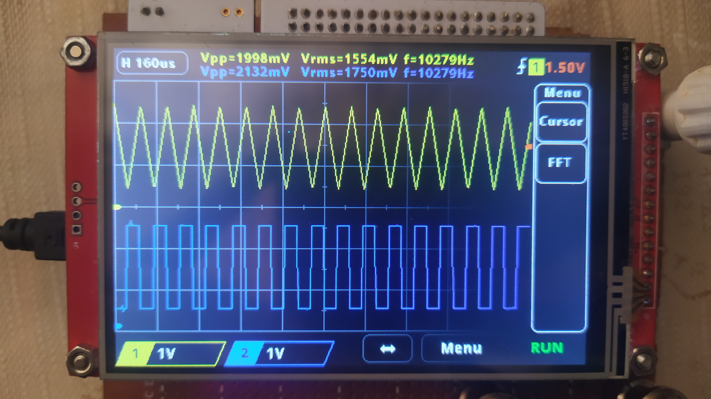

# KD 23MTS
Oscilloscope built with STML476RG and a 4" LCD with ili9488 driver.



## Project status: in construction.

## Project goals:
  - 2 channells
  - FFT
  - RMS, peak-to-peak, frequency measurements

## Connections

- LCD
  | STM pin | Component pin | Signal description |
  |---------|---------------|--------------------|
  | PA6     | SDO(MISO)     | TFT_MISO           |
  | PC9     | LED           | TFT_Backlight      |
  | PB3     | SCK           | TFT_SCK            |
  | PA7     | SDI(MOSI)     | TFT_MOSI           |
  | PC4     | DC/RS         | TFT_DC/RS          |
  | PA10    | RESET         | TFT_RESET          |
  | PC8     | CS            | TFT_CS             |


- Touchscreen
  | STM pin | Component pin | Signal description |
  |---------|---------------|--------------------|
  | -----   | T_IRQ         | T_IRQ              |
  | PC2     | T_DO          | Touch_MISO         |
  | PC3     | T_DIN         | Touch_MOSI         |
  | PB12    | T_CS          | Touch_CS           |
  | PB10    | T_CLK         | Touch_SCK          |

- Rotary encoder
  | STM pin | Component pin |
  |---------|---------------|
  | PA9     | ENC_A         |
  | PA8     | ENC_B         |
  | PC0     | ENC_BTN       |

## Touchscreen calibration
1. Navigate to the file `oscilloscope.c` and locate line 35. Remove the comment slashes (`//`) to activate the function `touchScreenCalibration();`. Save the changes and upload the code to the device.
2. Open a Serial monitor on your PC. You should observe the following prompt:
    ```
    Press the screen at the yellow squares that appear,
    then paste the following line into stm32_adafruit_ts.h :
    ```
3. Interact with the LCD screen by pressing on the three yellow squares. Upon completion, the calibration values will be displayed. For example:
    ```
    #define  TS_CINDEX            {1777297, 4469, -237569, 908499464, -171651, 9601, 587895710}
    ```
4. Follow the instructions provided in the previous step by copying and pasting the displayed line into the file stm32_adafruit_ts.h. After pasting, comment out line 35 in `oscilloscope.c`, and re-upload the modified code to the device.

## Used tools: 


## Authors:
- Dominik Pluta
- Kamil Winnicki
